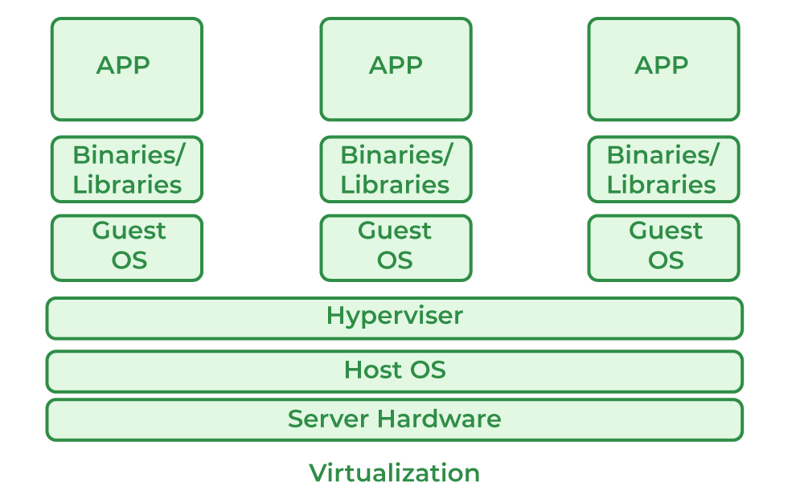

Absolutely — let’s break down **virtualization** in a clear, structured way:

---

### 🧠 What is Virtualization?

**Virtualization** is the process of creating a **virtual (rather than physical)** version of something — typically hardware platforms, storage devices, or operating systems.

In simple terms:

> It allows you to run **multiple virtual machines** (VMs) on a single physical machine.

---

### 🎯 Why Use Virtualization?

* 🧪 **Testing and development:** Run multiple OSes without needing separate hardware.
* 🛡️ **Isolation:** Each VM is separate — problems in one don't affect others.
* 💸 **Cost savings:** Maximize hardware usage, reduce need for physical machines.
* 🖥️ **Legacy software:** Run older apps in a virtual environment on newer machines.

---

### 🏗️ Key Components of Virtualization

| Component         | Description                                                                            |
| ----------------- | -------------------------------------------------------------------------------------- |
| **Host Machine**  | The physical computer running the virtualization software                              |
| **Hypervisor**    | Software that creates and manages virtual machines (e.g., VirtualBox, VMware, Hyper-V) |
| **Guest Machine** | A virtual machine running an operating system within the host                          |

---

### 🔧 Types of Virtualization

1. **Hardware Virtualization**

   * Virtual machines with full operating systems (e.g., Windows, Linux)
   * Managed by a **hypervisor** (e.g., VirtualBox, VMware, KVM)

2. **OS-Level Virtualization (Containers)**

   * Lightweight, shares host OS kernel (e.g., Docker)
   * More efficient for running isolated apps

3. **Storage, Network, and Application Virtualization**

   * Used in enterprise infrastructure and cloud systems

---

### 🛠️ Tools You Can Try

| Tool                   | Purpose                   | Notes                               |
| ---------------------- | ------------------------- | ----------------------------------- |
| **VirtualBox**         | Run virtual machines      | Free and open-source                |
| **VMware Workstation** | Professional VM manager   | Paid but powerful                   |
| **Hyper-V**            | Windows-native hypervisor | Available on Windows Pro/Enterprise |
| **Docker**             | OS-level container system | Efficient for app virtualization    |

---
Great question! Here's the key difference:

---

### 🔍 **Hypervisor vs Virtual Machine Manager (VMM)**

#### ✅ **Hypervisor**:

* The **core technology** that enables virtualization.
* Manages and runs **virtual machines** by abstracting hardware resources.
* Two types:

  * **Type 1 (bare metal)**: Runs directly on hardware (e.g., VMware ESXi, Microsoft Hyper-V, KVM)
  * **Type 2 (hosted)**: Runs on top of a host OS (e.g., VirtualBox, VMware Workstation)

#### ✅ **Virtual Machine Manager (VMM)**:

* A **user interface or tool** to manage virtual machines — often **built on top of a hypervisor**.
* Examples:

  * **Virt-Manager** is a GUI that manages KVM/QEMU (a hypervisor).
  * **VMware Workstation** is both a VMM and includes a type-2 hypervisor.
  * **VirtualBox** offers both VMM and hypervisor functionality in one.

---

### 🧠 TL;DR:

> A **VMM is often a tool that controls and manages virtual machines**, while the **hypervisor is the engine that runs them**.

---

